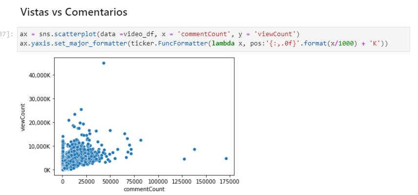
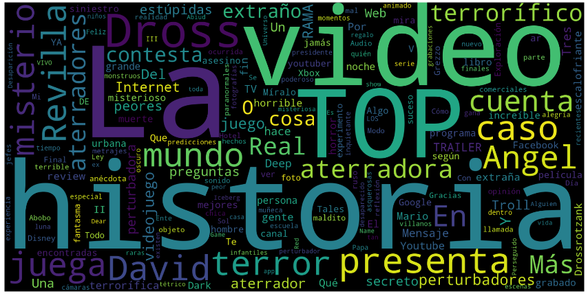

# EDA con la API de youtube
En este proyecto se realizan metodos para la extraccion, pre procesamiento y visualizacion de datos de canales de youtube con la ayuda de la API de youtube, proyecto basado en el video de [Thu Vu](https://www.youtube.com/c/Thuvu5)

## Herramientas utilizadas:
- Pandas
- Matplotlib
- Seaborn
- WordCloud
- JSON

## Algunas visualizaciones:

### Nube de palabras

